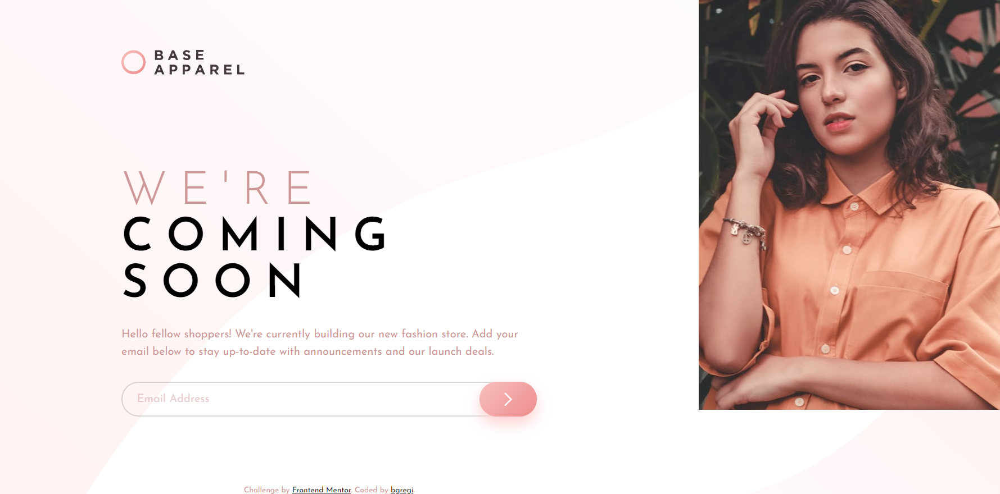

# Frontend Mentor - Base Apparel coming soon page solution

This is a solution to the [Base Apparel coming soon page challenge on Frontend Mentor](https://www.frontendmentor.io/challenges/base-apparel-coming-soon-page-5d46b47f8db8a7063f9331a0). Frontend Mentor challenges help you improve your coding skills by building realistic projects. 

## Table of contents

- [Overview](#overview)
  - [The challenge](#the-challenge)
  - [Screenshot](#screenshot)
  - [Links](#links)
- [My process](#my-process)
  - [Built with](#built-with)
  - [What I learned](#what-i-learned)
- [Author](#author)

## Overview

### The challenge

Users should be able to:

- View the optimal layout for the site depending on their device's screen size
- See hover states for all interactive elements on the page
- Receive an error message when the `form` is submitted if:
  - The `input` field is empty
  - The email address is not formatted correctly

### Screenshot

### Links

- Solution URL: [https://github.com/bgregi/base-apparel-coming-soon](https://github.com/bgregi/base-apparel-coming-soon)
- Live Site URL: [https://bgregi.github.io/base-apparel-coming-soon/](https://bgregi.github.io/base-apparel-coming-soon/)

## My process

### Built with

- CSS custom properties
- SASS
- Flexbox
- Mobile-first workflow
- Javascript

### What I learned

This challenge helped to consolidate what i've learned about CSS in the previous challenges, having to deal with different font styles, background images, hover and active statuses, input fields, buttons and transitions. I had no big problems with the javascript part, but it was a lot of fun.

I ended up adding a success message, which wasn't included in the challenge description, and also added a transition in the button size and color that i think added could improve the user experience.

## Author

- Website - [bgregi's GitHub Profile](https://github.com/bgregi)
- Frontend Mentor - [@bgregi](https://www.frontendmentor.io/profile/bgregi)